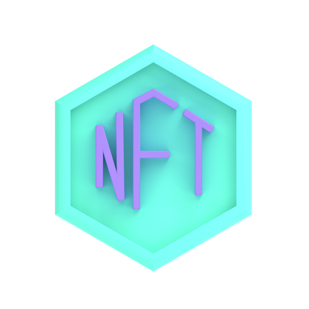

<h1 align="center">Hi , I'm Martin Obermeier </h1>

<h3 align="center"><i>Full Stack Developer - JavaScript</i></h3>

    

 

## About me

 

- I am a Full Stack Developer, mainly in JavaScript frameworks (React JS and Node JS).
- I have a degree in Systems from the University of Morón and I live in Buenos Aires, Argentina.
- I currently work as a Software Engineer at Santander Tecnología.

 

## Languages and Tools

 
  

<!--  -->

 
 
 

## My Personal Projects

 

-  [**Weather App**](https://mo-clima.netlify.app/): It is a weather web application developed with Reactjs with Hooks and Redux. It has user authentication both by email and Google account. For the backend, we implemented a REST API server in Nodejs with Express and a database in MongoDB. The Mapbox and OpenWeatherMap APIs are used to consult the information, and Cloudinary to store the users' profile photos. Workbox was also implemented to make this web application a PWA. User test: user1@mail.com - abc123.

 

-  [**Coin Market App**](https://mo-cryptos.netlify.app/): It is a simple web application to view and search for cryptocurrency quotes. It is developed in Reactjs with Hooks. It uses CoinGecko APIs to query cryptocurrency information. A Services Worker was implemented to make this web application a PWA.

 

-  [**Market Place NFT App**](https://mo-market-place.netlify.app/): It is a simple web application to publish and buy NFTs on the Binance test network "BNB Smart Chain Testnet" and Polygon test network "Mumbai". It is developed in React with Hooks, Bootstrap and React-Query for the frontend. For the backend, a Smart Contract with Solidity was implemented using HardHat. This application is under testing and little by little I will be adding things and improving it.

 
